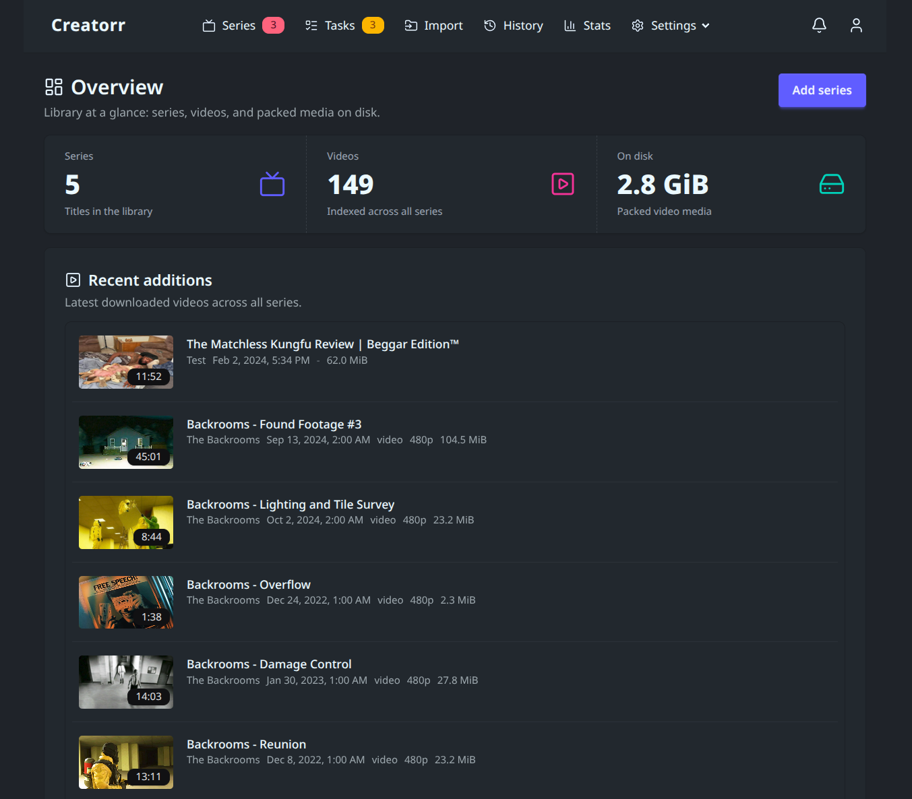

# Creatorr

Sonarr-shaped daemon for creator VOD: mirror channels and playlists, download with yt-dlp, and pack media-server-ready libraries (video or audio).



## Features

- **Scan, then download** - index sources into a video catalog; download wanted items on schedule or on demand
- **Multi-source series** - channels, playlists, and single-video URLs under one series and root folder
- **Library pack** - media under a root with media-server-compatible NFO and sidecars
- **Audio delivery (opt-in)** - per-series bestaudio remux to MKA as TV-style episodes
- **Quality profiles** - format selectors and optional maturity media/sidecar refresh
- **SponsorBlock** - mark and/or remove categories per quality profile (Creatorr-owned cut pipeline, not yt-dlp flags)
- **Domains & queues** - per-host limits, Access (cookies/credentials), soft pause
- **FlareSolverr & PO tokens** - Compose sidecars out of the box for challenge pre-solve and proof-of-origin minting
- **Web UI & API** - library overview, stats, and notifications in the browser; public OpenAPI REST for automation

Product behavior: [`docs/`](docs/README.md). REST contract: [`api/openapi.yaml`](api/openapi.yaml). Agent/contributor contract: [`AGENTS.md`](AGENTS.md).

## Quick start (production)

[`docker-compose.yml`](docker-compose.yml) pulls the published image (no local build):

```bash
docker compose up -d
```

| | |
| --- | --- |
| Image | `ghcr.io/xyxxyxxy/creatorr:latest` (`main`); `:develop`; `:sha-<short>` for pins |
| UI | `http://127.0.0.1:8787/` |
| Health | `GET /api/health` (`ok` \| `degraded` \| `down`) |
| OpenAPI | `GET /api/openapi.json` |

**Volumes** (host `./var` mirrors the container layout):

| Host | Container |
| --- | --- |
| `./var/data` | `/data` (SQLite `creatorr.db` + cache) |
| `./var/import` | `/import` |
| `CREATORR_INITIAL_ROOT_FOLDER` (default `./var/library`) | `/library` (fixed; initial root folder) |

Compose comments show optional mounts: extra library roots, `/yt-dlp-plugins`, custom yt-dlp binary.

Image includes the Creatorr binary plus **yt-dlp**, **ffmpeg**, and **Deno**. Runtime yt-dlp is `/usr/local/bin/yt-dlp`.

First boot seeds one root at `/library` (local Go: `var/library`) and quality profiles `best`, `HD 1080p`, `HD 720p`, `SD 480p`. Override the host bind in `.env` (`CREATORR_INITIAL_ROOT_FOLDER`) before first boot; add more roots later in Settings → Library.

### Sidecars

- **FlareSolverr** - Compose service `creatorr-flaresolverr` (headless Chrome; notable RAM). Set `CREATORR_FLARESOLVERR_URL` (Compose default `http://creatorr-flaresolverr:8191`). Enable **Use FlareSolverr** on a host under Settings → Queue / Domains.
- **PO tokens** - Compose service `creatorr-po-token`. Set `CREATORR_POT_PROVIDER_URL` (Compose default `http://creatorr-po-token:4416`) and **PO token fetch** under Settings → General. See [`docs/ytdlp.md`](docs/ytdlp.md).

### Custom yt-dlp

Bind-mount over the image path (`:ro`). Rebuild the image to bump the baked binary. Plugins stay under `/yt-dlp-plugins`.

```yaml
volumes:
  - /path/to/your/yt-dlp:/usr/local/bin/yt-dlp:ro
```

## Configuration

Paths are fixed (not env) except the Compose host bind for the initial root folder. When `/data` exists (container): SQLite `/data/creatorr.db`, cache `/data/cache`, import `/import`, plugins `/yt-dlp-plugins`; initial root folder is always `/library`. Local Go mirrors under `var/`.

HTTP always binds `0.0.0.0`. Most runtime knobs live in Settings (SQLite / UI). FlareSolverr and PO token provider URLs are env-only. Apprise channels are Settings.

| Variable | Default | Purpose |
| --- | --- | --- |
| `PUID` / `PGID` | `1000` | Host uid/gid for Compose `user:` on the Creatorr service (volume ownership). See `.env.example`. |
| `CREATORR_INITIAL_ROOT_FOLDER` | `./var/library` | Compose-only host path bind-mounted to fixed container `/library` (seeded as the initial root folder when `root_folders` is empty). |
| `CREATORR_PORT` | `8787` | HTTP port |
| `CREATORR_POT_PROVIDER_URL` | *(empty)* | bgutil PO token provider base URL. Compose default `http://creatorr-po-token:4416`. Empty disables Settings **PO token fetch**. |
| `CREATORR_FLARESOLVERR_URL` | *(empty)* | FlareSolverr base URL. Compose default `http://creatorr-flaresolverr:8191`. Empty skips Flare health/pre-solve. |
| `CREATORR_WEB_DEV` | off | Reload HTML/partials/`static/` from disk each request (`1` in `docker-compose.dev.yml`). |
| `CREATORR_WEB_DIR` | `internal/web` | UI root when `CREATORR_WEB_DEV` is on. |
| `TZ` | host / unset | Process local zone for **UI cron labels** only (stored cron still UTC). Prod compose `${TZ:-UTC}`. |

Full settings reference: [`docs/settings.md`](docs/settings.md).

## Development

Build from source with UI live reload:

```bash
./scripts/compose up -d --build
```

Or:

```bash
docker compose -f docker-compose.dev.yml up -d --build
```

[`docker-compose.dev.yml`](docker-compose.dev.yml) includes production compose, then adds `build: .`, `CREATORR_WEB_DEV`, and mounts `./internal/web`. Copy [`docker-compose.override.dev.example.yml`](docker-compose.override.dev.example.yml) to `docker-compose.override.dev.yml` (gitignored) for sibling plugin mounts. There is no auto-merged `docker-compose.override.yml`.

Local image without registry: `make image` (tags `creatorr:local`).

### Local Go

Paths use `./var/...` when `/data` is not a directory.

```bash
go run ./cmd/creatorr
# or: make build && ./bin/creatorr
```

```bash
make hooks      # once per clone: pre-commit runs make lint + make test
make test
make vet
make lint
make generate   # after editing api/openapi.yaml
make openapi-check
make css        # after Tailwind/daisyUI class or ECharts vendor changes
make sbom       # CycloneDX SBOM (needs syft); CI also license-gates it
```

Skip hooks for one commit: `SKIP_GITHOOKS=1 git commit ...` or `git commit --no-verify`.

CI: [`.github/workflows/ci.yml`](.github/workflows/ci.yml) on `main` and `develop`. Images: [`.github/workflows/docker.yml`](.github/workflows/docker.yml) (`:latest` on `main`, `:develop` on `develop`, plus `:sha-<short>`).

## Concepts

Terminology: [`docs/domain-model.md`](docs/domain-model.md). Agent naming pointers: [`AGENTS.md`](AGENTS.md).
