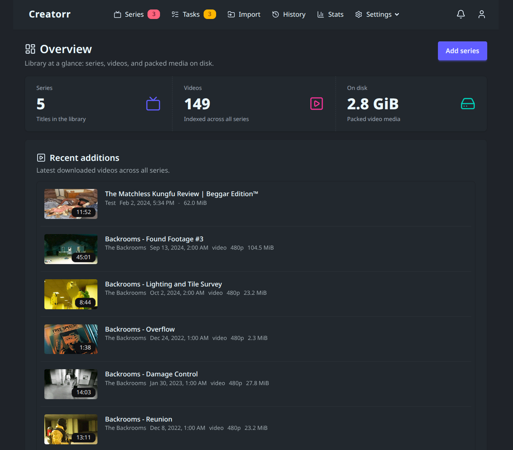

# Creatorr

Sonarr for creator VOD: manage creators as TV-style series. Merge multiple source URLs into one Creatorr series, index first, download using yt-dlp, then pack episodes with metadata ready for Emby, Jellyfin, and similar media servers.



## Concept

In Creatorr, a series holds one or many sources, usually a channel, playlist, or single-video URL. Sources are indexed and episode entries created before anything is downloaded.

```text
Creatorr
├── series A
│   └── source 1 (channel)
│       ├── episode 1 (external ID jK4mN8pQ2xL, released 2024)
│       └── episode 2 (external ID Rt7wB3cV9aH, released 2024)
└── series B
    ├── source 1 (channel)
    │   ├── episode 1 (external ID Ys2nF6dM1qE, released 2025)
    │   └── episode 2 (external ID Uc9hL5gT4zP, released 2025)
    └── source 2 (single video)
        └── episode (external ID Wa8eK1bX7mD, released 2024)
```

After a video is downloaded, it is packed as an episode and the following file structure emerges:

```text
file system
└── /library/
    ├── Series A/
    │   ├── tvshow.nfo
    │   ├── poster.jpg
    │   └── S2024/
    │       ├── S2024E0001 [jK4mN8pQ2xL].mkv
    │       ├── S2024E0001 [jK4mN8pQ2xL].nfo
    │       ├── S2024E0001 [jK4mN8pQ2xL].info.json
    │       ├── S2024E0001 [jK4mN8pQ2xL]-thumb.jpg
    │       ├── S2024E0002 [Rt7wB3cV9aH].mkv
    │       ├── S2024E0002 [Rt7wB3cV9aH].nfo
    │       ├── S2024E0002 [Rt7wB3cV9aH].info.json
    │       └── S2024E0002 [Rt7wB3cV9aH]-thumb.jpg
    └── Series B/
        ├── tvshow.nfo
        ├── poster.jpg
        ├── S2024/
        │   ├── S2024E0001 [Wa8eK1bX7mD].mkv
        │   ├── S2024E0001 [Wa8eK1bX7mD].nfo
        │   ├── S2024E0001 [Wa8eK1bX7mD].info.json
        │   └── S2024E0001 [Wa8eK1bX7mD]-thumb.jpg
        └── S2025/
            ├── S2025E0001 [Ys2nF6dM1qE].mkv
            ├── S2025E0001 [Ys2nF6dM1qE].nfo
            ├── S2025E0001 [Ys2nF6dM1qE].info.json
            ├── S2025E0001 [Ys2nF6dM1qE]-thumb.jpg
            ├── S2025E0002 [Uc9hL5gT4zP].mkv
            ├── S2025E0002 [Uc9hL5gT4zP].nfo
            ├── S2025E0002 [Uc9hL5gT4zP].info.json
            └── S2025E0002 [Uc9hL5gT4zP]-thumb.jpg
```

A media server can read it as-is, with full metadata and images for each series and its episodes.

Special episodes pack under series-level `Specials/` (Season 00). Special features (trailers, interviews, …) pack under series-level kind folders next to seasons, never inside `S{year}/`.

```text
file system
└── /library/
    └── Series A/
        ├── tvshow.nfo
        ├── poster.jpg
        ├── S2024/
        │   ├── S2024E0001 [jK4mN8pQ2xL].mkv
        │   └── …
        ├── Specials/
        │   ├── S00E0001 [bonusId].mkv
        │   └── S00E0001 [bonusId].nfo
        └── trailers/
            └── 01 My Trailer.mkv
```

## Features

- **Metadata fetching & management** - fetch and edit series/video metadata; pack NFO and sidecars for Emby, Jellyfin, and similar
- **Special episodes & extras** - pack as Season 00 Specials (NFO for Emby/Jellyfin) or extras folders (trailers, interviews, …) with separate naming formats
- **Quality profiles** - format selectors and optional maturity media/sidecar refresh
- **Domains & queues** - per-host rate limits, credentials (Access cookies), and soft pause
- **Smart cookie usage** - learn per source when cookies help; prefer them to cut wasted tries and spare the account
- **Web Archive fallback** - when an indexed YouTube video is deleted or unavailable, queue a [Web Archive](https://archive.org/) download
- **Import existing downloads** - bring in files already on disk with automated matching
- **Integrity check** - optional per-profile file integrity (null-decode + checksums)
- **Audio-only series** - per-series bestaudio remux to MKA as TV-style episodes
- **SponsorBlock** - chapters, cut-out, and cut-out with an inserted info card
- **FlareSolverr & PO tokens** - Compose sidecars out of the box for challenge pre-solve and proof-of-origin minting
- **Video retention** - delete media after a configured number of days
- **Automatic yt-dlp updates** - scheduled GitHub checks when cron is set; Connect **Update now** always works (even with empty schedule)
- **Notifications** - in-app alerts plus Apprise channels for digests and warnings

Product behavior: [`docs/`](docs/README.md). REST contract: [`api/openapi.yaml`](api/openapi.yaml). Agent/contributor contract: [`AGENTS.md`](AGENTS.md).

## Quick start (production)

[`docker-compose.yml`](docker-compose.yml) pulls the published image:

```bash
docker compose up -d
```

| Item | Detail |
| --- | --- |
| Image | `ghcr.io/xyxxyxxy/creatorr:latest` (version tag `v*` on `main`); `:dev` tracks tip of `main` (+ manual workflow dispatch); `:sha-<short>` for pins |
| UI | `http://127.0.0.1:8787/` (first visit: **Setup** account, then login) |
| Health | `GET /api/health` (`ok` \| `degraded` \| `down`; no auth) |
| OpenAPI | `GET /api/openapi.json` (requires API key or session after setup) |

**Volumes** (host `./var` mirrors the container layout):

| Host | Container |
| --- | --- |
| `./var/data` | `/data` (SQLite `creatorr.db` + cache) |
| `./var/import` | `/import` |
| `./var/library` | `/library` (initial root folder seed) |

Compose comments show optional mounts: extra library roots, `/yt-dlp-plugins`.

## Configuration

Most options live in the UI under Settings.

Common env vars (see [`.env.example`](.env.example)):

| Variable | Default | Purpose |
| --- | --- | --- |
| `PUID` / `PGID` | `1000` | Host user for volume ownership |
| `CREATORR_PORT` | `8787` | HTTP port |
| `CREATORR_POT_PROVIDER_URL` | Compose sidecar | PO token provider (empty disables) |
| `CREATORR_FLARESOLVERR_URL` | Compose sidecar | FlareSolverr (empty disables) |
| `TZ` | `UTC` in Compose | Timezone for UI schedule labels |

Full reference: [`docs/settings.md`](docs/settings.md).

### Reset password

Stop Creatorr, clear the password hash, start again, then complete Setup:

```bash
sqlite3 ./var/data/creatorr.db <<'SQL'
UPDATE settings SET value = '' WHERE key = 'auth_password_hash';
SQL
```

Or use [DB Browser for SQLite](https://sqlitebrowser.org/) and clear `auth_password_hash` in the `settings` table.

## Development

Build from source with UI live reload:

```bash
./scripts/compose up -d --build
```

Or:

```bash
docker compose -f docker-compose.dev.yml up -d --build
```

[`docker-compose.dev.yml`](docker-compose.dev.yml) includes production compose, then adds `build: .`, `CREATORR_WEB_DEV`, and mounts `./internal/web`. Copy [`docker-compose.override.dev.example.yml`](docker-compose.override.dev.example.yml) to `docker-compose.override.dev.yml` (gitignored) for sibling plugin mounts. There is no auto-merged `docker-compose.override.yml`.

Local image without registry: `make image` (tags `creatorr:local`).

### Local Go

Paths use `./var/...` when `/data` is not a directory.

```bash
go run ./cmd/creatorr
# or: make build && ./bin/creatorr
```

```bash
make hooks      # once per clone: pre-commit runs make lint + make test
make test       # host Go, or Docker golang image if go missing
make vet
make lint       # golangci-lint in Docker (version pinned in Makefile; needs Docker)
make generate   # after editing api/openapi.yaml
make openapi-check
make css        # after Tailwind/daisyUI class or ECharts vendor changes
make sbom       # CycloneDX SBOM (needs syft); CI also license-gates it
```

Skip hooks for one commit: `SKIP_GITHOOKS=1 git commit ...` or `git commit --no-verify`.

CI: [`.github/workflows/ci.yml`](.github/workflows/ci.yml) on `main` and pull requests. Images: [`.github/workflows/docker.yml`](.github/workflows/docker.yml) (`:sha-<short>` and `:dev` on every `main` push or workflow dispatch; `:latest`, `:X.Y.Z`, and `:X.Y` when you push a `v*` tag).

## Concepts

Terminology: [`docs/domain-model.md`](docs/domain-model.md). Agent naming pointers: [`AGENTS.md`](AGENTS.md).
